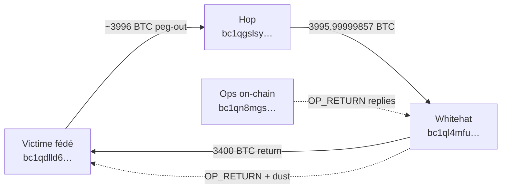

# Chronologie filtrée — whitehat + victime

## Adresses

| Rôle | Adresse |
|---|---|
| **Victime (wallet fédé BTC)** | [`bc1qdlld6antmv4xug242ed83q7k4rqw50cwfns38szx4qu2f4jwaxxsuhwxxr`](https://mempool.space/address/bc1qdlld6antmv4xug242ed83q7k4rqw50cwfns38szx4qu2f4jwaxxsuhwxxr) |
| Ops on-chain (réponses) | [`bc1qn8mgsmxx42j3fflqfkh0cqhdd6mj4h9q2mfqym`](https://mempool.space/address/bc1qn8mgsmxx42j3fflqfkh0cqhdd6mj4h9q2mfqym) |
| Whitehat | [`bc1ql4mfu6aundtkksxklfajs2h3t9nzcd6gyqjlte`](https://mempool.space/address/bc1ql4mfu6aundtkksxklfajs2h3t9nzcd6gyqjlte) |
| Hop financement | [`bc1qgslsydz56d0ed6827hdemfmk5w2f6ldyc6wt7p`](https://mempool.space/address/bc1qgslsydz56d0ed6827hdemfmk5w2f6ldyc6wt7p) |

L’adresse victime **n’émet aucun OP_RETURN**. Les réponses on-chain utiles partent de l’adresse ops (`security@` / PGP signés).

## Graphe



## Synthèse

| # | UTC | Bloc | Type | Événement | Tx |
|---:|---|---:|---|---|---|
| 1 | 2026-09-06 14:28:56 UTC | 965783 | Peg-out victime | Consolidation / peg-out ~4019.44 BTC → hop intermédiaire (puis whitehat) | [`8db751a650…`](https://mempool.space/tx/8db751a650ae2f12006b7e8c69a75e4df360e8afd6b9e05ae0b9fa6458a7b140) |
| 2 | 2026-09-06 14:28:56 UTC | 965783 | Hop → whitehat | Financement initial 3995.99999857 BTC | [`85d2ca15be…`](https://mempool.space/tx/85d2ca15bea33a592e73ed40c6a5da887feecf1e77f58ec7f580e00841645043) |
| 3 | 2026-09-06 18:30:10 UTC | 965818 | Message whitehat | we are whitehats. contact us on chain | [`c103de9581…`](https://mempool.space/tx/c103de95817b43f2df635ec6f35ff126ca26a7c6d20570c4b01866b2b3e69a19) |
| 4 | 2026-09-06 19:31:47 UTC | 965822 | Message ops (victime) | Please contact security@blockstream.com | [`91271efcbb…`](https://mempool.space/tx/91271efcbb5ab29abfc38ae635f0644e3ba042aad56f92d40136e1dde4742fe8) |
| 5 | 2026-09-07 01:49:49 UTC | 965865 | Message ops (victime) | Encrypted to the key behind bc1ql4mfu6aundtkksxklfajs2h3t9nzcd6gyqjlte (Electrum BIE1 ECIES):  QklFM | [`bd81219691…`](https://mempool.space/tx/bd81219691eb1e22475c5985d847fa888c38f1b6d2cb2b7193f54d0cfa72394c) |
| 6 | 2026-09-07 02:20:18 UTC | 965869 | Message whitehat | sending most back to bc1qdlld6antmv4xug242ed83q7k4rqw50cwfns38szx4qu2f4jwaxxsuhw… | [`3a3eac4a26…`](https://mempool.space/tx/3a3eac4a26395b8c2563aaf1eb8b1b77798c81c7d6337f51321827a244a480aa) |
| 7 | 2026-09-07 03:30:05 UTC | 965875 | Message whitehat | Please fix the bug first. The chain is under risk at latest commit right now. Ma… | [`83825b2135…`](https://mempool.space/tx/83825b2135dd0abac12c9dfe17f29ab81b3427e1ae864947b0bebce5e47c3c4b) |
| 8 | 2026-09-07 03:30:05 UTC | 965875 | Message ops (victime) | Yes, thank you. | [`8a444eed65…`](https://mempool.space/tx/8a444eed65c4584f138e08ee138f61490ef73e84f71e14dac3ca66c230cf7e97) |
| 9 | 2026-09-07 11:46:42 UTC | 965922 | Message ops (victime) | Bridge nodes are patched, safe to return the funds. | [`87dc0a2009…`](https://mempool.space/tx/87dc0a20099a94c2caaa3fa93d1724cfe41b05ae5e0778cc0e8994b22e81120c) |
| 10 | 2026-09-07 12:43:33 UTC | 965930 | Message whitehat | plz confirm again that we are sending the coins back to bc1qdlld6antmv4xug242ed8… | [`0256e33797…`](https://mempool.space/tx/0256e33797ab173a5df1f2cd9689a81241f385dabb7e998e06ce78855ff19016) |
| 11 | 2026-09-07 15:31:46 UTC | 965948 | Message whitehat | Message PGP (chiffré) | [`4656114340…`](https://mempool.space/tx/4656114340749ba4aade1affcb2625a1dac37214b32b7d7c242af2ca9fe6d690) |
| 12 | 2026-09-07 16:09:25 UTC | 965950 | Retour fonds | Retour exact 3400 BTC | [`a6d697a252…`](https://mempool.space/tx/a6d697a25266ce3c78774fd1d75f896b7af522ada209b0f6228ea497bc49a46d) |

## Détail

### 1. 2026-09-06 14:28:56 UTC · bloc 965783 — Consolidation / peg-out ~4019.44 BTC → hop intermédiaire (puis whitehat)
- **Type:** Peg-out victime
- **From:** `bc1qdlld6antmv4xug242ed83q7k4rqw50cwfns38szx4qu2f4jwaxxsuhwxxr`
- **Tx:** [`8db751a650ae2f12006b7e8c69a75e4df360e8afd6b9e05ae0b9fa6458a7b140`](https://mempool.space/tx/8db751a650ae2f12006b7e8c69a75e4df360e8afd6b9e05ae0b9fa6458a7b140)
- vout0 = bc1qgslsydz56d0ed6827hdemfmk5w2f6ldyc6wt7p (3996.01834922 BTC). Aucun OP_RETURN depuis l'adresse victime elle-même.
- Flux: send=4019.44426085 recv=0 fee=34097 sats
- Sorties:
  - vout0: **3996.01834922 BTC** → `bc1qgslsydz56d0ed6827hdemfmk5w2f6ldyc6wt7p`
  - vout1: **2.65138358 BTC** → `bc1qkxwva32eh7mgezq5kladncd3n5wtcjmslh98my`
  - vout2: **3.99601658 BTC** → `bc1qk3cvk5599nydy8zwavlxaduke54pgf4vl0ckru`
  - vout3: **1.67692605 BTC** → `bc1qdlld6antmv4xug242ed83q7k4rqw50cwfns38szx4qu2f4jwaxxsuhwxxr`
  - vout4: **1.67791605 BTC** → `bc1qdlld6antmv4xug242ed83q7k4rqw50cwfns38szx4qu2f4jwaxxsuhwxxr`

### 2. 2026-09-06 14:28:56 UTC · bloc 965783 — Financement initial 3995.99999857 BTC
- **Type:** Hop → whitehat
- **From:** `bc1qgslsydz56d0ed6827hdemfmk5w2f6ldyc6wt7p`
- **Tx:** [`85d2ca15bea33a592e73ed40c6a5da887feecf1e77f58ec7f580e00841645043`](https://mempool.space/tx/85d2ca15bea33a592e73ed40c6a5da887feecf1e77f58ec7f580e00841645043)
- Hop bc1qgslsydz56d0ed6827hdemfmk5w2f6ldyc6wt7p → bc1ql4mfu6aundtkksxklfajs2h3t9nzcd6gyqjlte. Fonds provenant du wallet victime via 8db751a650ae2f12…
- Flux: send=0.0 recv=3995.99999857 fee=143 sats
- Sorties:
  - vout0: **3995.99999857 BTC** → `bc1ql4mfu6aundtkksxklfajs2h3t9nzcd6gyqjlte`
  - vout1: **0.01834922 BTC** → `bc1qje74edww9q3fct2442cwmhd7pyntyqryrpsmkt`

### 3. 2026-09-06 18:30:10 UTC · bloc 965818 — we are whitehats. contact us on chain
- **Type:** Message whitehat
- **From:** `bc1ql4mfu6aundtkksxklfajs2h3t9nzcd6gyqjlte`
- **Tx:** [`c103de95817b43f2df635ec6f35ff126ca26a7c6d20570c4b01866b2b3e69a19`](https://mempool.space/tx/c103de95817b43f2df635ec6f35ff126ca26a7c6d20570c4b01866b2b3e69a19)
- Flux: send=3998.49749714 recv=3998.49748445 fee=269 sats
- Sorties:
  - vout0: **0.00000000 BTC** → `op_return`
  - vout1: **0.00001000 BTC** → `bc1qdlld6antmv4xug242ed83q7k4rqw50cwfns38szx4qu2f4jwaxxsuhwxxr`
  - vout2: **3998.49748445 BTC** → `bc1ql4mfu6aundtkksxklfajs2h3t9nzcd6gyqjlte`
- OP_RETURN vout0:
  ```
we are whitehats. contact us on chain
  ```

### 4. 2026-09-06 19:31:47 UTC · bloc 965822 — Please contact security@blockstream.com
- **Type:** Message ops (victime)
- **From:** `bc1qn8mgsmxx42j3fflqfkh0cqhdd6mj4h9q2mfqym`
- **Tx:** [`91271efcbb5ab29abfc38ae635f0644e3ba042aad56f92d40136e1dde4742fe8`](https://mempool.space/tx/91271efcbb5ab29abfc38ae635f0644e3ba042aad56f92d40136e1dde4742fe8)
- Sorties:
  - vout0: **0.00001000 BTC** → `bc1ql4mfu6aundtkksxklfajs2h3t9nzcd6gyqjlte`
  - vout1: **0.00000000 BTC** → `op_return`
- OP_RETURN vout1:
  ```
Please contact security@blockstream.com
  ```

### 5. 2026-09-07 01:49:49 UTC · bloc 965865 — Encrypted to the key behind bc1ql4mfu6aundtkksxklfajs2h3t9nzcd6gyqjlte (Electrum BIE1 ECIES):  QklFM
- **Type:** Message ops (victime)
- **From:** `bc1qn8mgsmxx42j3fflqfkh0cqhdd6mj4h9q2mfqym`
- **Tx:** [`bd81219691eb1e22475c5985d847fa888c38f1b6d2cb2b7193f54d0cfa72394c`](https://mempool.space/tx/bd81219691eb1e22475c5985d847fa888c38f1b6d2cb2b7193f54d0cfa72394c)
- Sorties:
  - vout0: **0.00001000 BTC** → `bc1ql4mfu6aundtkksxklfajs2h3t9nzcd6gyqjlte`
  - vout1: **0.00000000 BTC** → `op_return`
- OP_RETURN vout1:
  ```
Encrypted to the key behind bc1ql4mfu6aundtkksxklfajs2h3t9nzcd6gyqjlte (Electrum BIE1 ECIES):

QklFMQLaSmCm5qeNvxcJnaVGKqIVzH5Y3oL2OrBYayfMegxjxLWEAzoQ65PcqzgkWdj+3KyQBOel5JDKGiAwvt5jwZjsrch0CgDNMrqzsVWBfMD5gdMy79ngeankI4rog7V9pko=

Detached signature by security@blockstream.com. Public key: https://blockstream.com/pgp.txt

Fingerprint: 1176 542D A98E 71E1 3372 2EF7 4AC8 CC88 6844 A2D6

Verify: gpg --import pgp.txt && gpg --verify msg.asc msg.b64

-----BEGIN PGP SIGNATURE-----

iQIzBAABCgAdFiEEEXZULamOceEzci73SsjMiGhEotYFAmqeD+sACgkQSsjMiGhE

otYifg//XZFx8WQGQhzzAWoCOGJGio3O7sg1MPbZyhaY7AJNGuzSdrsWnrjoDaJ+

5Qy0AFHrJPy9KNQwQakItw1p01SYPNDUJWc0oVjaw0knWf5tv/vgY/r+Cp7axEcw

BO80wcUVtPeyGIGX3WE1k9vjFOl6of+0nIWt8Wj45xo9EvuNZp10JrJluHVsJeD9

C5eqeyHojPGRE0vtVocUdqsSJsQBb0zx+163BnZn2wZUMRFzCQ+bHclfCNyoVjtP

fAViyROsHTw/dgdRlG2ZMkWOyBgO4Nmj8IgavPFDRg+7TwuqTgcM4i9vC/yo462b

55K8dJtwpZJBD5tcg5c/VkHbzC+H/dfXYAWMhIAqwBv7kLR3xx8/54RXfJLekhTn

1PgiG3t84aB/WJSQtrDk3QpvvPJJNRY2OXiiNxLKMks02tjpJER6iljBXuWOgRun

/vt2Nt93y3lzB5gTJM7ygxMI2F6rfo1qWcENePjAoTm6TJzNZ3eoYWoYY/yBPaxy

LpysbuFzP9pfRD/0oh4BsWXn176+PnNOGZ+C0lZb4wehKdL4gUaoFQz+eR0zgvr8

+2jjLjz4qwMl1eVV1V0hjvjOlTtEm1kPIdPK3HgHw1e7S1BlMGiNMEUpb51Z8m55

FKNiL0046oy0SplZD7VfIFRzRQ6IYHosYCOyY5dVaArQYDqPen0=

=HAck

-----END PGP SIGNATURE-----
  ```

### 6. 2026-09-07 02:20:18 UTC · bloc 965869 — sending most back to bc1qdlld6antmv4xug242ed83q7k4rqw50cwfns38szx4qu2f4jwaxxsuhw…
- **Type:** Message whitehat
- **From:** `bc1ql4mfu6aundtkksxklfajs2h3t9nzcd6gyqjlte`
- **Tx:** [`3a3eac4a26395b8c2563aaf1eb8b1b77798c81c7d6337f51321827a244a480aa`](https://mempool.space/tx/3a3eac4a26395b8c2563aaf1eb8b1b77798c81c7d6337f51321827a244a480aa)
- Flux: send=3998.49850762 recv=3998.4984855 fee=1212 sats
- Sorties:
  - vout0: **0.00000000 BTC** → `op_return`
  - vout1: **0.00001000 BTC** → `bc1qdlld6antmv4xug242ed83q7k4rqw50cwfns38szx4qu2f4jwaxxsuhwxxr`
  - vout2: **3998.49848550 BTC** → `bc1ql4mfu6aundtkksxklfajs2h3t9nzcd6gyqjlte`
- OP_RETURN vout0:
  ```
sending most back to bc1qdlld6antmv4xug242ed83q7k4rqw50cwfns38szx4qu2f4jwaxxsuhwxxr, is that ok
  ```

### 7. 2026-09-07 03:30:05 UTC · bloc 965875 — Please fix the bug first. The chain is under risk at latest commit right now. Ma…
- **Type:** Message whitehat
- **From:** `bc1ql4mfu6aundtkksxklfajs2h3t9nzcd6gyqjlte`
- **Tx:** [`83825b2135dd0abac12c9dfe17f29ab81b3427e1ae864947b0bebce5e47c3c4b`](https://mempool.space/tx/83825b2135dd0abac12c9dfe17f29ab81b3427e1ae864947b0bebce5e47c3c4b)
- Flux: send=3998.49853372 recv=3998.49849036 fee=3336 sats
- Sorties:
  - vout0: **0.00000000 BTC** → `op_return`
  - vout1: **0.00001000 BTC** → `bc1qdlld6antmv4xug242ed83q7k4rqw50cwfns38szx4qu2f4jwaxxsuhwxxr`
  - vout2: **3998.49849036 BTC** → `bc1ql4mfu6aundtkksxklfajs2h3t9nzcd6gyqjlte`
- OP_RETURN vout0:
  ```
Please fix the bug first. The chain is under risk at latest commit right now. Make sure every node is patched. Then we will transfer the money back safely after confirming the fix. The detail is as follows (encrypted using https://blockstream.com/pgp.txt).
  ```
  - + PGP MESSAGE chiffré

### 8. 2026-09-07 03:30:05 UTC · bloc 965875 — Yes, thank you.
- **Type:** Message ops (victime)
- **From:** `bc1qn8mgsmxx42j3fflqfkh0cqhdd6mj4h9q2mfqym`
- **Tx:** [`8a444eed65c4584f138e08ee138f61490ef73e84f71e14dac3ca66c230cf7e97`](https://mempool.space/tx/8a444eed65c4584f138e08ee138f61490ef73e84f71e14dac3ca66c230cf7e97)
- Sorties:
  - vout0: **0.00001000 BTC** → `bc1ql4mfu6aundtkksxklfajs2h3t9nzcd6gyqjlte`
  - vout1: **0.00000000 BTC** → `op_return`
- OP_RETURN vout1:
  ```
Yes, thank you.
  ```

### 9. 2026-09-07 11:46:42 UTC · bloc 965922 — Bridge nodes are patched, safe to return the funds.
- **Type:** Message ops (victime)
- **From:** `bc1qn8mgsmxx42j3fflqfkh0cqhdd6mj4h9q2mfqym`
- **Tx:** [`87dc0a20099a94c2caaa3fa93d1724cfe41b05ae5e0778cc0e8994b22e81120c`](https://mempool.space/tx/87dc0a20099a94c2caaa3fa93d1724cfe41b05ae5e0778cc0e8994b22e81120c)
- Sorties:
  - vout0: **0.00001000 BTC** → `bc1ql4mfu6aundtkksxklfajs2h3t9nzcd6gyqjlte`
  - vout1: **0.00000000 BTC** → `op_return`
- OP_RETURN vout1:
  ```
Bridge nodes are patched, safe to return the funds.
  ```

### 10. 2026-09-07 12:43:33 UTC · bloc 965930 — plz confirm again that we are sending the coins back to bc1qdlld6antmv4xug242ed8…
- **Type:** Message whitehat
- **From:** `bc1ql4mfu6aundtkksxklfajs2h3t9nzcd6gyqjlte`
- **Tx:** [`0256e33797ab173a5df1f2cd9689a81241f385dabb7e998e06ce78855ff19016`](https://mempool.space/tx/0256e33797ab173a5df1f2cd9689a81241f385dabb7e998e06ce78855ff19016)
- Flux: send=3998.49939856 recv=3998.49929211 fee=9645 sats
- Sorties:
  - vout0: **0.00000000 BTC** → `op_return`
  - vout1: **0.00001000 BTC** → `bc1qdlld6antmv4xug242ed83q7k4rqw50cwfns38szx4qu2f4jwaxxsuhwxxr`
  - vout2: **3998.49929211 BTC** → `bc1ql4mfu6aundtkksxklfajs2h3t9nzcd6gyqjlte`
- OP_RETURN vout0:
  ```
plz confirm again that we are sending the coins back to bc1qdlld6antmv4xug242ed83q7k4rqw50cwfns38szx4qu2f4jwaxxsuhwxxr
More details about the vuln fix:
  ```
  - + PGP MESSAGE chiffré

### 11. 2026-09-07 15:31:46 UTC · bloc 965948 — Message PGP (chiffré)
- **Type:** Message whitehat
- **From:** `bc1ql4mfu6aundtkksxklfajs2h3t9nzcd6gyqjlte`
- **Tx:** [`4656114340749ba4aade1affcb2625a1dac37214b32b7d7c242af2ca9fe6d690`](https://mempool.space/tx/4656114340749ba4aade1affcb2625a1dac37214b32b7d7c242af2ca9fe6d690)
- Flux: send=3998.49955855 recv=3998.49951464 fee=3391 sats
- Sorties:
  - vout0: **0.00000000 BTC** → `op_return`
  - vout1: **0.00001000 BTC** → `bc1qdlld6antmv4xug242ed83q7k4rqw50cwfns38szx4qu2f4jwaxxsuhwxxr`
  - vout2: **3998.49951464 BTC** → `bc1ql4mfu6aundtkksxklfajs2h3t9nzcd6gyqjlte`
- OP_RETURN vout0:
  - + PGP MESSAGE chiffré

### 12. 2026-09-07 16:09:25 UTC · bloc 965950 — Retour exact 3400 BTC
- **Type:** Retour fonds
- **From:** `bc1ql4mfu6aundtkksxklfajs2h3t9nzcd6gyqjlte`
- **To:** `bc1qdlld6antmv4xug242ed83q7k4rqw50cwfns38szx4qu2f4jwaxxsuhwxxr`
- **Tx:** [`a6d697a25266ce3c78774fd1d75f896b7af522ada209b0f6228ea497bc49a46d`](https://mempool.space/tx/a6d697a25266ce3c78774fd1d75f896b7af522ada209b0f6228ea497bc49a46d)
- Flux: send=3998.49957662 recv=598.49955894 fee=1768 sats
- Sorties:
  - vout0: **598.49955894 BTC** → `bc1ql4mfu6aundtkksxklfajs2h3t9nzcd6gyqjlte`
  - vout1: **3400.00000000 BTC** → `bc1qdlld6antmv4xug242ed83q7k4rqw50cwfns38szx4qu2f4jwaxxsuhwxxr`

## Filtre

- **Inclus:** from whitehat · peg-out from wallet victime · OP_RETURN from adresse ops
- **Exclus:** spam tiers / fausse demande 3900+bounty

